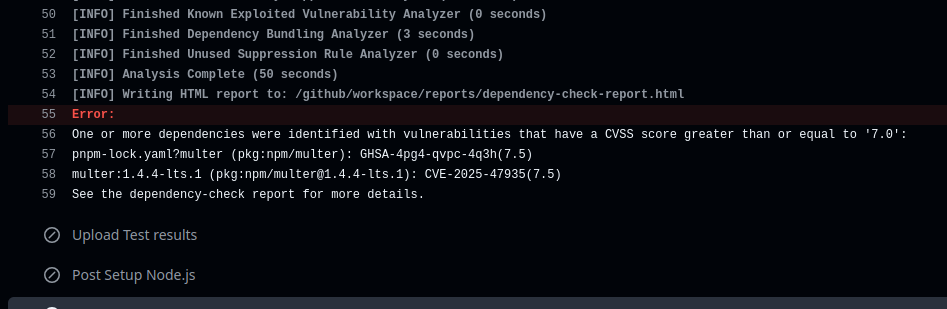
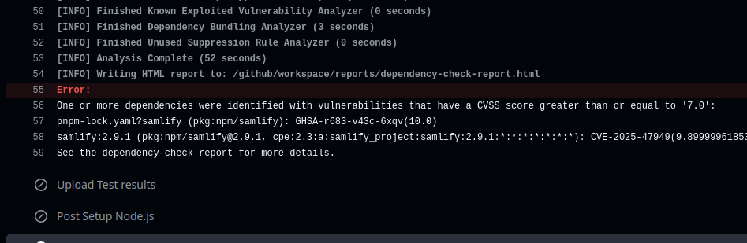

# Uso da Ação Dependency-Check no GitHub Actions

A ação `dependency-check/dependency-check-action` do GitHub Marketplace automatiza a análise de vulnerabilidades em dependências de projetos, eliminando a necessidade de download manual do Dependency-Check ou atualização do banco de dados NVD (National Vulnerability Database). Esta documentação usa exemplos fictícios de pacotes com vulnerabilidades (`multer@1.4.4-lts.1` e `samlify@2.9.1`) para demonstrar o uso da ação.

## Benefícios

- **Automação**: Integração com pipelines CI/CD no GitHub Actions.
- **Atualização Automática**: Banco de dados NVD sempre atualizado.
- **Rápida Identificação**: Detecta vulnerabilidades em poucos minutos.

## Testes

#### Com dependencia multer 1.4.4-lts.1 que foi reportada em 19 de maio de 2025

https://github.com/expressjs/multer/security/advisories/GHSA-4pg4-qvpc-4q3h

```shell
pnpm install multer@2.0.0
```



Identificado em 1m 30s!

#### Com dependencia samlify@2.9.1 a vulnerabilidade foi reportada em 03/2025

https://snyk.io/advisor/npm-package/samlify

```shell
pnpm install samlify@2.9.1
```



Identificado em 1m 24s
